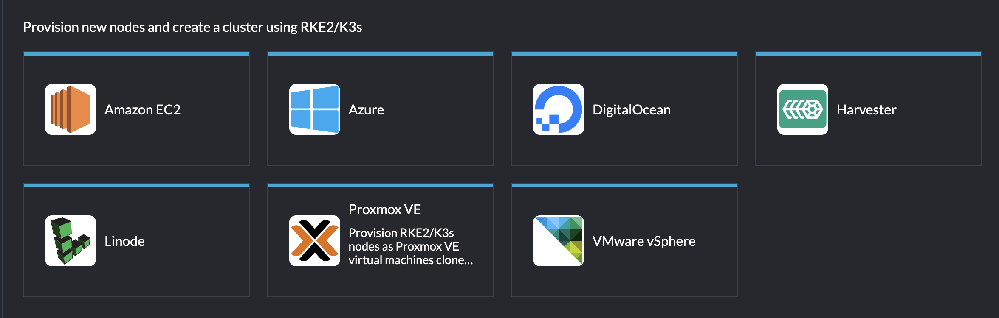

# pve-rancher-driver

A [Rancher node driver](https://ranchermanager.docs.rancher.com/pages-for-subheaders/node-drivers-and-node-templates)
for [Proxmox VE](https://www.proxmox.com/en/proxmox-virtual-environment/overview).
It lets Rancher provision, scale and delete RKE2/K3s cluster nodes as Proxmox VE
virtual machines, cloned from a template you prepare once. Authentication is via
a PVE API token — no root password ever lands in a cloud credential.

- **Machine pools** work the way they do for any other Rancher provider: pick a
  template, a size and a count, and scale from the UI.
- **Data disks** are attached, formatted and mounted by the driver before the
  node joins, so storage backends like Longhorn get a real device rather than a
  directory on the root filesystem.
- **DHCP addressing** with discovery through the QEMU guest agent, MAC-matched
  to the right interface.



## Install

Two charts on the Rancher **local** cluster: the driver, and the UI extension
that gives it a proper form. Requires Rancher 2.10+ and Proxmox VE 8 or 9.

### 1. Add the repositories

**Apps → Repositories → Create**, twice:

| | Driver | UI extension |
|---|---|---|
| Name | `pve-rancher-driver` | `pve-rancher-ui-extension` |
| Target | Git repository | Git repository |
| Git Repo URL | `https://github.com/Lore09/pve-rancher-driver.git` | `https://github.com/Lore09/pve-rancher-ui-extension.git` |
| Git Branch | `master` | `master` |

### 2. Install the driver chart

**Apps → Charts → Proxmox VE Node Driver → Install.** The namespace
(`cattle-system`) and release name are pre-filled by the chart.

Before you click through, set one value — **add your Proxmox host to the
allow-list**:

```yaml
nodeDriver:
  whitelistDomains:
    - github.com
    - objects.githubusercontent.com
    - release-assets.githubusercontent.com
    - pve.example.com      # <- yours
```

Keep all three GitHub entries: they are the release redirect chain, and dropping
any one leaves the driver stuck in `Downloading` with no error. Your PVE host
goes in as a **hostname only** — no scheme, no `:8006`.

If your Rancher server runs on arm64, also set `nodeDriver.arch: linux-arm64`.
This is the architecture of the Rancher server, not of the VMs it provisions.

### 3. Install the UI extension

**Apps → Extensions → Proxmox VE Node Driver UI → Install.** (If the Extensions
page is not enabled yet, Rancher offers to enable it first.)

Without this you still get a working driver, but the machine-pool form is
Rancher's generic one — no template/storage/bridge dropdowns, no Test
Connection, and no validation of data-disk mount paths.

### 4. Verify

```bash
kubectl get nodedriver pve -o jsonpath='{.status.conditions[?(@.type=="Downloaded")].status}{"\n"}'
```

`True` means Rancher fetched the binary. **Cluster Management → Drivers → Node
Drivers** should show *pve* as Active.

Other install routes — Helm CLI, the raw manifest, self-hosted binaries for
air-gapped clusters — plus the full chart values reference are in
[docs/installation.md](docs/installation.md).

## Prepare Proxmox VE

Two things are needed before the first cluster.

**An API token**, scoped to a PVE resource pool rather than to the whole
cluster (`/`). Every VM this driver creates is placed into that pool as part
of the clone call itself, so a token whose destructive privileges are only
granted on the pool cannot touch anything else PVE hosts — Proxmox refuses
the attempt regardless of what Rancher asks the driver to do. The privilege
set differs between PVE 8 and 9; the driver probes the live server version
and tells you which one it wants:

```bash
# The pool every VM this driver creates will land in. Add the template to it
# too (replace 9000 with your template's VMID) — that is what lets one role
# cover both cloning it and managing what gets cloned from it.
pveum pool add rancher-managed
pveum pool modify rancher-managed --vms 9000

# Every privilege the token needs, scoped to that pool only.
pveum role add RancherPVENode -privs "VM.Clone,VM.Allocate,VM.Audit,VM.PowerMgmt,VM.Config.Disk,VM.Config.CPU,VM.Config.Memory,VM.Config.Network,VM.Config.Cloudinit,VM.Config.Options,VM.GuestAgent.Audit,Pool.Allocate"

# Cluster-wide, but read-only or not VM-specific — granting these broadly
# does not let the token touch another VM's lifecycle.
pveum role add RancherPVECluster -privs "Sys.Audit,Datastore.Audit,Datastore.AllocateSpace,SDN.Use"

pveum user add rancher@pve
pveum user token add rancher@pve machine

pveum acl modify /pool/rancher-managed -user  rancher@pve           -role RancherPVENode
pveum acl modify /pool/rancher-managed -token 'rancher@pve!machine' -role RancherPVENode
pveum acl modify /                     -user  rancher@pve           -role RancherPVECluster --propagate 0
pveum acl modify /                     -token 'rancher@pve!machine' -role RancherPVECluster --propagate 0
```

That is the **PVE 9** set. On PVE 8 replace `VM.GuestAgent.Audit` with
`VM.Monitor` in `RancherPVENode`, or grant both to cover either. The token
secret is printed once — save it. Every ACL line above is required for both
the user and the token: PVE tokens do not inherit the user's privileges.

Every machine pool must then set **Resource Pool** to `rancher-managed` (the
`pve-pool` field) to match — a pool created without it will fail to clone,
since the token has no permission to create VMs outside `rancher-managed`.
The trade-offs of this ACL and how to verify it actually blocks access to
other VMs are in
[docs/rancher-setup.md](docs/rancher-setup.md#restricting-the-token-to-a-resource-pool).

Two variants, if the default above doesn't fit:

- Want the template itself off-limits to the token too — readable and
  clonable, but never startable, deletable or reconfigurable? Keep it out of
  the pool and grant it a narrower role instead; see
  [Keeping the template outside the pool](docs/rancher-setup.md#keeping-the-template-outside-the-pool).
- Nothing else runs on this PVE host and isolation doesn't matter? Skip the
  pool entirely: grant `VM.Clone,VM.Allocate,VM.Audit,VM.PowerMgmt,VM.Config.Disk,VM.Config.CPU,VM.Config.Memory,VM.Config.Network,VM.Config.Cloudinit,VM.Config.Options,VM.GuestAgent.Audit,Sys.Audit,Datastore.AllocateSpace,Datastore.Audit,SDN.Use,Pool.Allocate`
  on `/` for both `-user` and `-token`, and leave `pve-pool` empty.

**A VM template** with `qemu-guest-agent` baked in, a cloud-init drive, and a
login user with passwordless sudo. Recipes for Debian 13 and openSUSE Leap Micro
6.2, plus the packages Longhorn needs, are in
[docs/template-preparation.md](docs/template-preparation.md).

## Create a cluster

**Cluster Management → Create → Proxmox VE**, then create a cloud credential
from the token above and size your machine pools. The field-by-field walkthrough
and a troubleshooting matrix are in
[docs/rancher-setup.md](docs/rancher-setup.md).

The one field that catches everyone: **VM User** must be the account that
actually exists in your image — `debian` for Debian's cloud image, `rancher` for
Leap Micro. It defaults to `root`, which neither permits, and the symptom is a
node that provisions fine and then never reaches `Ready`.

## How it works

```
Rancher UI   ──┐
                ├─► docker-machine-driver-pve (this binary)
                │       │
PVE REST API ◄──┘       ├─ Resolve target node (or first online node)
                        ├─ Generate the machine's SSH keypair
                        ├─ Clone template VMID -> new VMID
                        ├─ Apply overrides (cores, sockets, memory, onboot,
                        │   cloud-init ipconfig0 / ciuser / sshkeys incl. the
                        │   generated public key)
                        ├─ Attach the declared data disks, each tagged with a
                        │   PVE disk serial
                        ├─ Start the VM
                        ├─ Capture the NIC MAC, then poll the QEMU guest
                        │   agent for the IPv4 on that exact interface
                        └─ SSH in and format/mount the data disks
                            → returns "created" once the disks are mounted
```

Disks are found in the guest by **serial**, never by kernel name: `sdb`/`sdc`
ordering is not stable once a VM has more than one data disk. Formatting is
idempotent — a disk that already carries a filesystem is never reformatted.

## Documentation

| Guide | What it covers |
|---|---|
| [installation.md](docs/installation.md) | Chart values, Helm/manifest/air-gapped installs, upgrades |
| [template-preparation.md](docs/template-preparation.md) | Building the VM template; guest packages for Longhorn |
| [networking.md](docs/networking.md) | Choosing a node network segment, and how the nodes get addresses |
| [rancher-setup.md](docs/rancher-setup.md) | Cloud credential, machine-pool fields, troubleshooting |
| [flags.md](docs/flags.md) | Every driver flag, including the `pve-data-disk` grammar |
| [development.md](docs/development.md) | Building, testing, releasing, adding a flag |

## Compatibility

- **Rancher** 2.10+ with `management.cattle.io/v3` `NodeDriver` support.
- **Proxmox VE** 8.x and 9.x, with the API token role above.
- **Guest images** any cloud image with `qemu-guest-agent`, cloud-init and a
  passwordless-sudo user. Debian 13 and openSUSE Leap Micro 6.2 are the two
  documented and verified paths.

## License

MIT — see [LICENSE](LICENSE).
